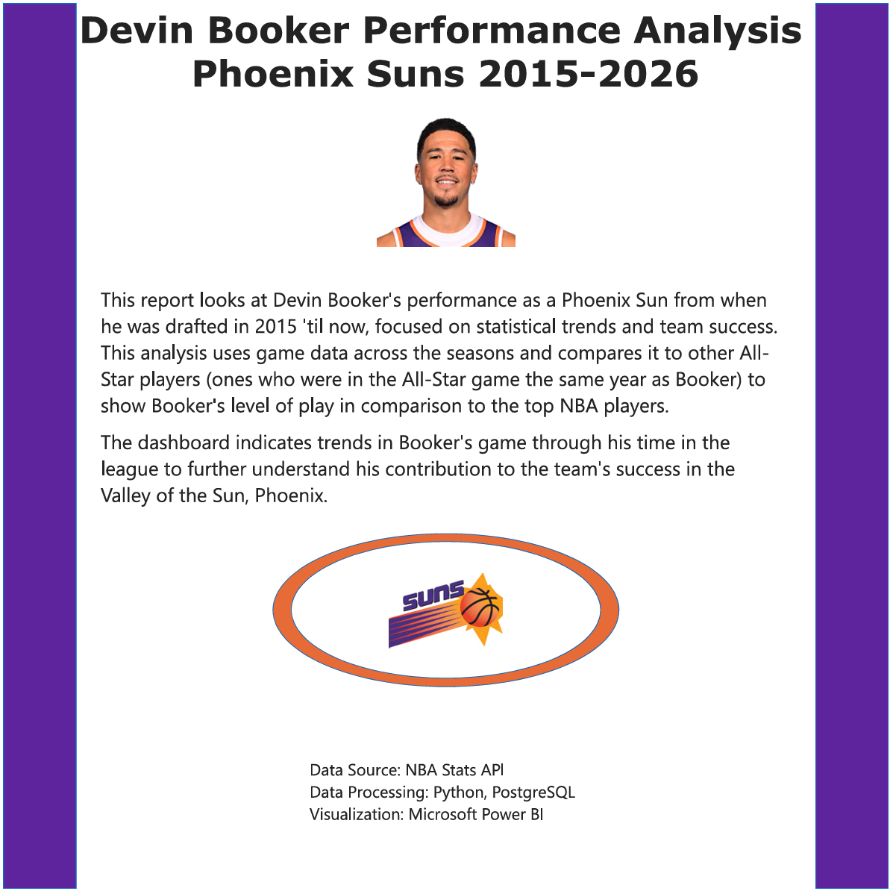
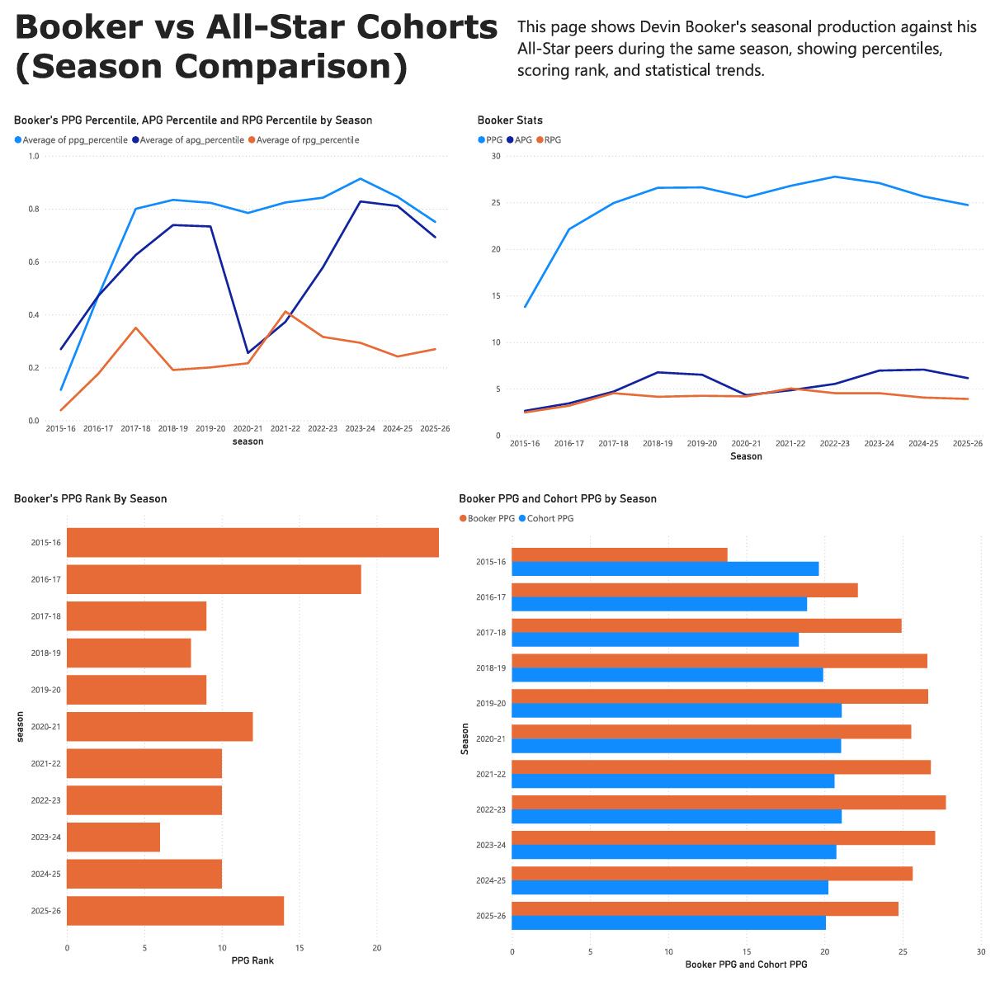
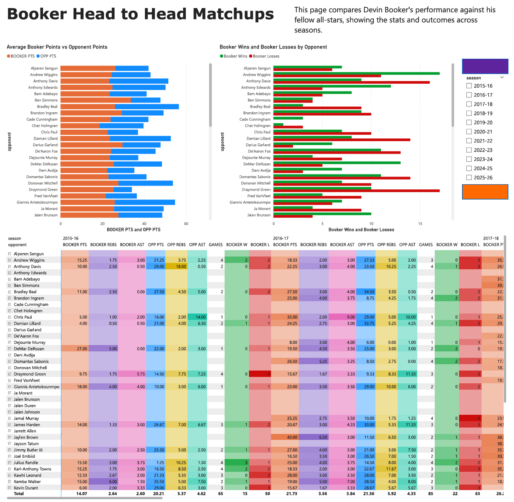
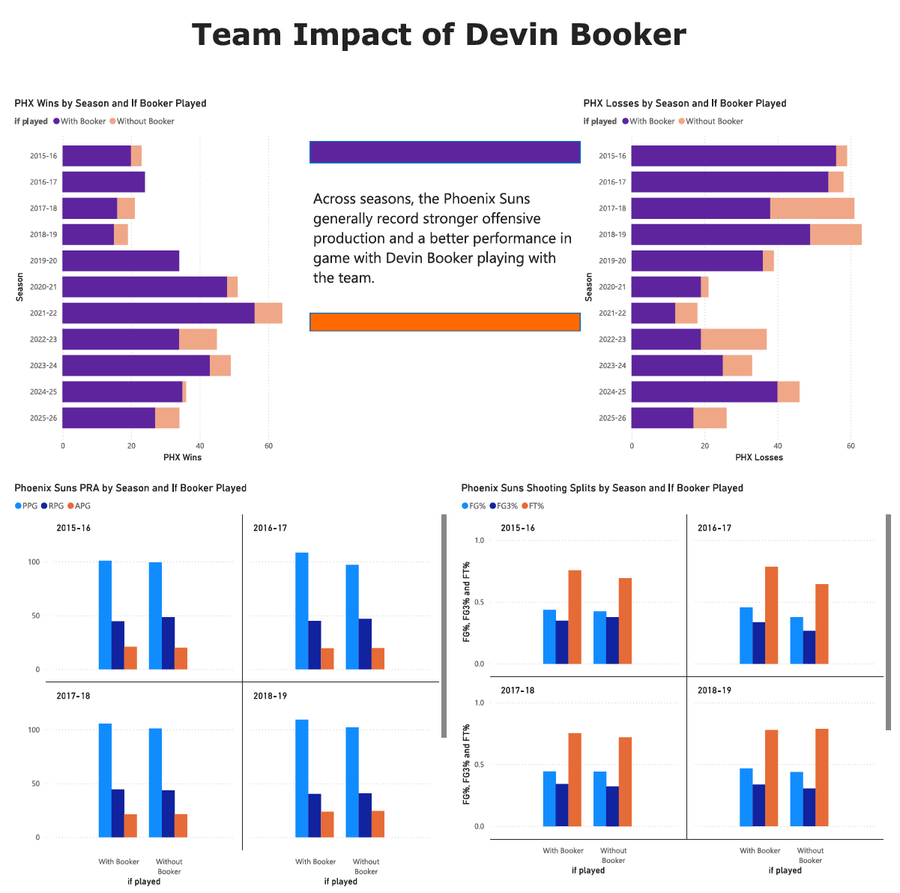
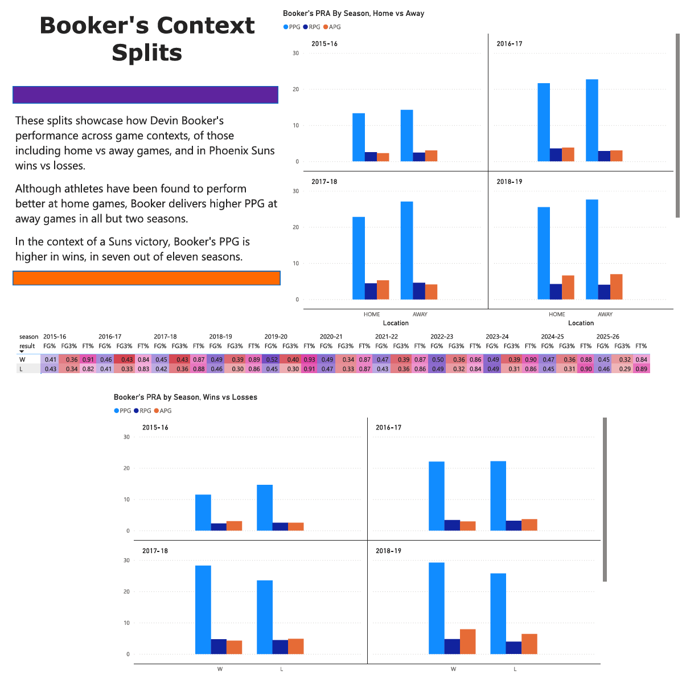
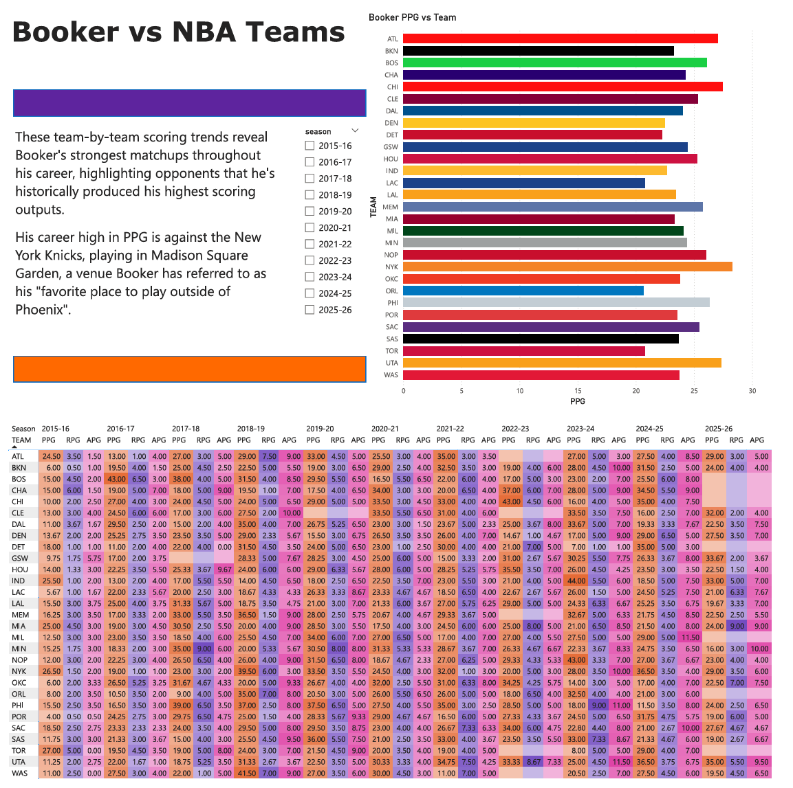

# Devin Booker Performance Analysis (2015–2026)

This project wouldn't be possible without the use of the NBA_API, documentation can be found at https://github.com/swar/nba_api/tree/master made by Swar Patel.
As said on the documentation on there, the requests and numpy packages are needed to utilize this tool.
The NBA_API tool is used for extracting the data of several the past 10 years of NBA games from the teams and players.

Focused on the angle of Devin Booker's career, and how his regular  in regards to the 60+ other unique players who'd been named an all-star the same year as him (2020, 2021, 2022, 2024, 2026). All the names and all-star game rosters can be found on `all_stars.txt` to help give better context in who will be getting compared to him.

---

## Project Overview

This project analyzes Devin Booker’s career performance through a full analytics pipeline:

NBA Stats API  
↓  
Python ETL  
↓  
PostgreSQL Data Warehouse  
↓  
SQL Analytics Marts  
↓  
Power BI Dashboard  

The analysis focuses on:

- Booker vs All-Star cohort performance
- Head-to-head player matchups
- Phoenix Suns performance with and without Booker
- Contextual splits (home vs away, wins vs losses)
- Booker performance against individual NBA teams

---

## Repository Structure

```
nba_api/
│
├── to_players_csvs/          # 62 csv files of player data from 2015-2026
├── to_games_csvs/            # 30 csv files of all team data from 2015-2026
│
├── warehouse/
│   ├── fact_player_game.csv
│   └── fact_team_game.csv
│
├── sql/
│   ├── schema.sql
│   └── marts/
│       ├── build_marts.sql
│       ├── mart_booker_vs_cohort.sql
│       ├── mart_booker_head_to_head_summary.sql
│       ├── mart_booker_home_away.sql
│       ├── mart_booker_wins_losses.sql
│       ├── mart_booker_team_impact_with_without.sql
│       └── mart_booker_vs_opponent_team.sql
│
├── powerbi/
|   ├── devin_booker_analytics_comparisons.pdf
│   └── devin_booker_analytics_comparisons.pbix
│
├── requirements.txt
└── README.md
```

---

## Setup

Install Python dependencies:

```
pip install -r requirements.txt
```

Create the PostgreSQL database:

```
CREATE DATABASE nba_warehouse;
```

---

## Build the Database

Run the warehouse schema:

```
psql -d nba_warehouse -f sql/schema.sql
```

Build all analytics marts:

```
psql -d nba_warehouse -f sql/marts/build_marts.sql
```

---

## Power BI Dashboard

The final analysis is visualized using a Power BI dashboard located in:

```
powerbi/devin_booker_analytics_comparisons.pbix
```

Open the file using **Microsoft Power BI Desktop** and connect to the `nba_warehouse` PostgreSQL database.

The dashboard contains six analytical sections:

## 1. Introduction


## 2. Booker vs All-Star Cohort


## 3. Head-to-Head Matchups


## 4. Team Impact


## 5. Context Splits


## 6. Booker vs NBA Teams

---

## Technologies Used

- Python
- PostgreSQL
- SQL
- Power BI
- NBA Stats API

---

## Author

Jordan Clifford  
Arizona State University – Computer Science